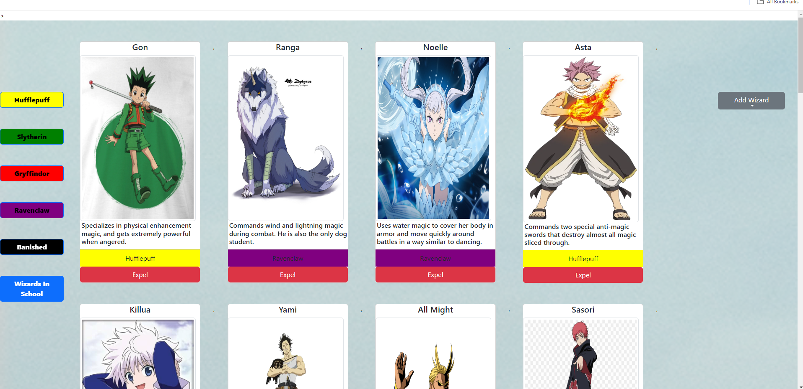

# Welcome to Max's WartHogs Project.

This is a basic explanation of how this projects works.

[My App](https://mjswarthogs.netlify.app)

## How You Can Use It
- The ideal user for this application is a teacher who will have a mid-to-vast group of students and needs help sorting them.
- There is also many other valid usings of this application, such as too keep track of status in a board game, or to keep track of a sports team. (If arrays are emptied.)
- This also is extremely useful to add students into a random group when adding them to the page.

## Features
- When a new student is added a card with their information on it will be displayed on the array as well as the current array.
- House Colors: The color of the student's card changes depending on which house they have been sorted into.
- Card Ordering: The students are currently only able to be sorted by class, but if you reset the array from scratch and readd students, the groups will be random again. (NEED NEW ADDON FOR THIS)
- Banished Students: There is also a separate array for students that are not participating due to something they have done.

## Video Walkthrough of APP NAME
https://www.loom.com/share/36050abd8da04900b84466feef9aeb20?sid=33d24b14-d8dc-44a4-beb0-ccb844a9fd95

## Relevant Links 
- [Check out the deployed site]((https://mjswarthogs.netlify.app))
- [DB Diagram](https://dbdiagram.io/d/Wizard-Diagram-6695c7829939893dae01a2a6)
- [GitHub Repo](https://github.com/MaxJones129/INDIVIDUAL-PROJECT-sorting-hat.git)

## Project Screenshots 

## Contributors
- [Max Jones](https://github.com/MaxJones129)
